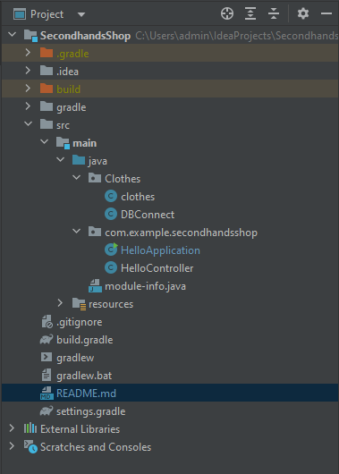

# JavaFX Project

## Project structure:

## Entity Relationship Model:

## Done features:
    Manage clothesShop (CRUD)
## Doing features:
    Sign in, Sign up
## Will do-features:
    Don't have plan
## Issues:
    Connect with database...

## Link demo: [Demo](https://drive.google.com/file/d/1d-595ucvKSgzBV-Vkkuo0T0H6r-zcxJK/view?usp=sharing)